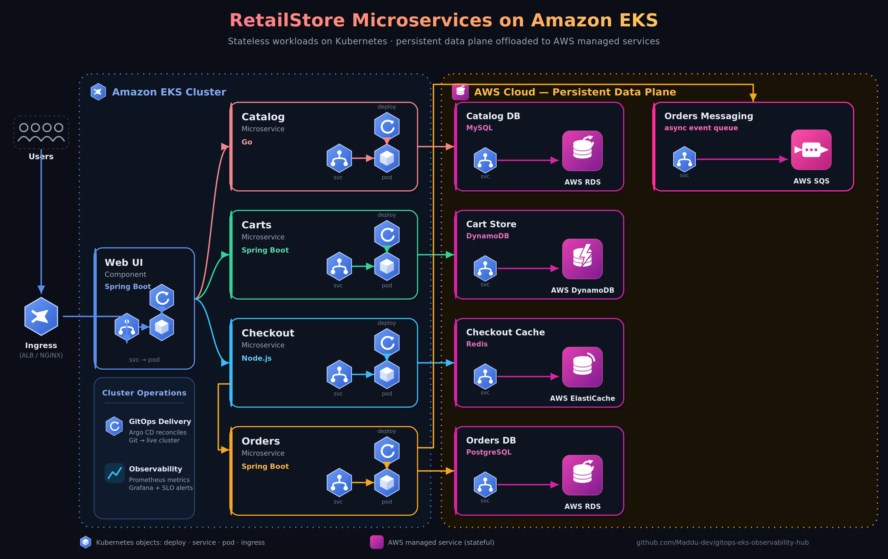

# GitOps EKS Observability Hub

A hands-on DevOps project where I deployed a multi-service application on AWS EKS with a full GitOps pipeline and observability stack. The goal was to get practical experience across the entire lifecycle — from containerising services with Docker to automating deployments via ArgoCD and monitoring them with Prometheus and Grafana.

---

## What This Project Covers

### Docker & Containerisation
- Wrote Dockerfiles for each microservice using multi-stage builds to keep images lean
- Used Docker Compose to run all services locally before pushing to the cloud
- Images are tagged with Git commit SHAs and stored in Amazon ECR

### Infrastructure as Code — Terraform
- Provisioned all AWS resources using Terraform — nothing manually created in the console
- Resources include: VPC, subnets, EKS cluster, RDS (MySQL), ElastiCache (Redis), DynamoDB, SQS, IAM roles, and ECR repositories
- Remote state stored in S3 with DynamoDB locking to prevent conflicts

### Kubernetes on AWS EKS
- Deployed all microservices to an EKS cluster with proper resource requests/limits, liveness and readiness probes
- Configured Ingress with AWS ALB for external traffic and SSL termination via ACM
- Used Karpenter for node autoscaling with Spot Instances to keep compute costs low
- Applied PodDisruptionBudgets to maintain availability during node changes

### CI/CD — GitHub Actions + ArgoCD
- GitHub Actions handles the CI side: runs tests, builds Docker images, pushes to ECR, and updates the Kubernetes manifest with the new image tag
- ArgoCD handles the CD side: watches the manifests repository and automatically syncs changes to the cluster
- Rollback is done by reverting a Git commit — ArgoCD picks it up automatically

---

## AWS Services Used

VPC · EKS · ECR · RDS (MySQL) · ElastiCache (Redis) · DynamoDB · SQS · ALB · ACM · CloudWatch · IAM · S3

---

## Tools & Technologies

Terraform · Kubernetes · Docker · GitHub Actions · ArgoCD · Karpenter · Helm · Prometheus · Grafana

## Architecture

  

The RetailStore application runs as four independent microservices on Amazon EKS, fronted by a Spring Boot Web UI behind an AWS ALB Ingress (SSL via ACM). All stateful workloads are offloaded to managed AWS services — Catalog to RDS (MySQL), Carts to DynamoDB, Checkout to ElastiCache (Redis), and Orders to RDS (PostgreSQL), with order events published asynchronously to SQS. The cluster keeps only stateless compute; everything persistent lives in the AWS data plane.

Deployments follow a GitOps model — GitHub Actions builds and pushes images to ECR and bumps the manifest tag, then ArgoCD reconciles the manifests repo to the live cluster. Prometheus scrapes service metrics and Grafana visualises them, with alerting on SLOs.

---

## Author

**Maddu Veeranareshkumar**
[GitHub](https://github.com/Maddu-dev)

